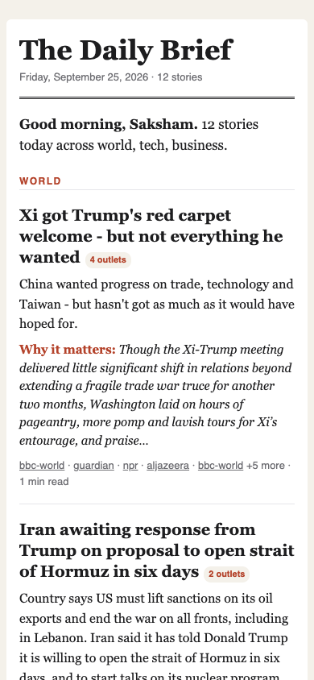

# newsbrief

Collects the day's news from RSS/Atom feeds, Hacker News and (optionally) scraped
section pages, merges near-duplicate stories across outlets, ranks them, summarizes
them with Claude (or an extractive fallback), and emails each subscriber a
responsive HTML brief at their own local send time.

<p align="center">
  
</p>

Full-page desktop render of a real run: [docs/brief-desktop.png](docs/brief-desktop.png).

## How it works

```
sources ──► collect ──► cluster ──► rank ──► filter ──► summarize ──► render ──► deliver
 rss/atom    parallel,   shingles +   recency,  already-   Claude Opus   HTML +     SMTP / Resend /
 hackernews  robots.txt  idf-weighted source    sent,      5.5, or       plain      SendGrid, or
 page        respected   Jaccard      weight,   lookback,  extractive    text       --dry-run outbox
                                      coverage  per-topic
                                                cap
```

| Step | Module | Notes |
|---|---|---|
| Sources | `feeds.py`, `hn.py`, `scrape.py` | RSS 2.0, RSS 1.0 (RDF) and Atom via `xml.etree`; the official HN API; `page` sources scrape headline links from a section page. Tracking params (`utm_*`, `at_medium`, ...) are stripped. |
| Article text | `extract.py`, `http.py` | Fetches each chosen story's page (and every outlet's page for the top story), respecting `robots.txt` and per-source `fetch_text`, and keeps the parent element holding the most paragraph text. 429/5xx are retried with backoff; a domain that answers 401/402/403 is skipped for an hour, one that fails 3 times in a row for 5 minutes. |
| Dedupe | `dedupe.py` | Exact URL dedupe, then leader clustering: cross-outlet 3-word shingle Jaccard (syndicated copy), idf-weighted keyword Jaccard over title + lede with at least two shared keywords (rewrites of the same event), or shared names: words capitalised mid-sentence and acronyms ("OpenAI", "Medicare", "NYC"). Phrases an outlet repeats across items ("Get our breaking news email...") are stripped first, and live blogs never lead a story. Scored by `newsbrief eval`. |
| Ranking | `rank.py` | `recency (12h half-life) × source weight × (1 + log2 outlets) × HN popularity`, then each subscriber's topic weights, boosts and mutes, then a per-topic cap so one busy beat can't fill the brief. |
| State | `state.py` | SQLite: URLs already sent to each subscriber (so tomorrow's brief doesn't repeat them), deliveries per local day, unsubscribes, and each day's brief for the web archive. |
| Summaries | `summarize.py` | `claude-opus-5-5` via `messages.parse` with a Pydantic schema (headline, summary, intro, and a "why it matters" line for the top story only), `effort: medium`. Falls back to extractive summaries with no API key, a refusal, truncation or any API error. The extractive "why it matters" picks an on-topic sentence about consequences, records or risks, and is left out when none qualifies. |
| Email | `render.py`, `deliver.py`, `unsubscribe.py` | Table layout with inline CSS and a text/plain alternative, with reading time for stories whose article text was fetched. HMAC unsubscribe link, `List-Unsubscribe` and one-click `List-Unsubscribe-Post` headers. |
| Archive | `archive.py` | Static `index.html` plus one page per day, no subscriber data, GitHub Pages ready. |

## Quick start

```sh
python -m venv .venv && . .venv/bin/activate
pip install -e '.[claude]'          # drop [claude] for extractive-only
cp newsbrief.example.yaml newsbrief.yaml   # add yourself under subscribers
cp .env.example .env                        # fill in what you need
set -a; . ./.env; set +a

newsbrief check                 # validate config, show who gets which sources
newsbrief check --feeds         # also fetch every feed: freshness, failures, article access
newsbrief subscribers add you@example.com --tz Europe/London --send-at 07:00
newsbrief run --dry-run         # build briefs into ./outbox/*.eml + *.html, send nothing
open outbox/*.html
newsbrief run                   # really send (needs a transport, see below)
```

Only addresses listed under `subscribers:` ever receive email. `--dry-run` never sends
and never writes sent-story state, so a dry run doesn't hide stories from the next real run.
It does store the brief itself, so `newsbrief archive` can preview the site; a real send
the same day replaces it.

## Configuration

`newsbrief.yaml` (or `.json`). See [`newsbrief.example.yaml`](newsbrief.example.yaml).

```yaml
from_email: "The Daily Brief <brief@example.com>"
base_url: "https://brief.example.com"   # where `newsbrief serve` is reachable; "" = mailto-only unsubscribe
max_stories: 12
max_per_topic: 5
lookback_hours: 36
sources:
  bbc-world: {type: rss, url: "https://feeds.bbci.co.uk/news/world/rss.xml", weight: 1.3, topics: [world]}
  hn:        {type: hackernews, url: topstories, limit: 30, weight: 0.9, topics: [tech]}
  npr-sci:   {type: page, url: "https://www.npr.org/sections/science/", topics: [science]}
  npr:       {type: rss, url: "https://feeds.npr.org/1001/rss.xml", topics: [us], fetch_text: false}  # blocks page fetches
subscribers:
  - email: you@example.com
    name: You
    timezone: Europe/London     # any IANA zone
    send_at: "07:00"            # local time
    topics: [world, tech]       # optional filter
    sources: [bbc-world, hn]    # optional filter
    max_stories: 8              # optional override
    topic_weights: {tech: 1.5, business: 0.5}   # optional rank multiplier per topic; 0 hides it
    boost: [climate, "open source"]             # optional: x1.5 when a title/blurb mentions one
    mute: [celebrity]                           # optional: drop stories that mention one
```

Unknown topics, sources or keys, duplicate subscribers, bad timezones and bad `send_at`
values are config errors.

### Managing subscribers

```sh
newsbrief subscribers list
newsbrief subscribers add ann@example.com --name Ann --tz Asia/Kolkata --send-at 06:30 --topics world,tech
newsbrief subscribers remove ann@example.com
```

`add` validates the whole resulting config before writing. Only the `subscribers:` section
of a YAML file is rewritten: comments elsewhere survive, comments inside that section don't.

### Environment

| Variable | Purpose |
|---|---|
| `ANTHROPIC_API_KEY` | Claude summaries (optional) |
| `NEWSBRIEF_SECRET` | Key for unsubscribe tokens. **Required** for real sends and `serve`; only `--dry-run` works without it. |
| `NEWSBRIEF_TRANSPORT` | `smtp`, `resend` or `sendgrid`. Otherwise picked from whichever of the variables below is set. |
| `SMTP_HOST`, `SMTP_PORT`, `SMTP_USER`, `SMTP_PASS` | SMTP. Port 587 uses STARTTLS, 465 uses implicit TLS. |
| `RESEND_API_KEY` / `SENDGRID_API_KEY` | HTTP email APIs |

## Scheduling

Each subscriber gets one brief per local day, on the first run after their `send_at`.

- **Once**: `newsbrief run --only-due` from any scheduler.
- **Long-running**: `newsbrief schedule --interval 300` (reloads config on every tick).
- **cron**: [`deploy/crontab.example`](deploy/crontab.example).
- **launchd (macOS)**: [`deploy/com.newsbrief.schedule.plist`](deploy/com.newsbrief.schedule.plist).
- **GitHub Actions**: [`.github/workflows/brief.yml`](.github/workflows/brief.yml) runs hourly once you set the repo
  variable `NEWSBRIEF_ENABLED=true`. The config lives in the `NEWSBRIEF_CONFIG` secret, so subscriber
  addresses stay out of the repo. The SQLite state is carried between runs in the Actions cache.
  A manual dispatch defaults to a dry run and uploads the outbox as an artifact.

## Unsubscribing

Every email has an unsubscribe link and `List-Unsubscribe` header, signed with `NEWSBRIEF_SECRET`.

- `newsbrief serve --port 8025` serves `/unsubscribe`. Put it behind TLS and set `base_url`.
  A GET only shows a confirmation button, so mail scanners that follow links can't unsubscribe
  anyone. The POST (also used by RFC 8058 one-click) records the unsubscribe.
- `newsbrief unsubscribe EMAIL TOKEN` does the same from the shell, for example for mailto requests.

## Feed health

`newsbrief check --feeds` fetches every source and reports freshness, failures and whether
article pages can be fetched (it probes each feed's first item). It exits 3 if any feed is
`FAIL`, `EMPTY` or `STALE` (newest item older than `--stale-hours`, default 24), so it can
drive a monitor. Plain `newsbrief check` stays offline. Live output, 2026-09-25:

```
$ newsbrief -c newsbrief.example.yaml check --feeds
8 sources, 1 subscribers
  you@example.com at 07:00 America/New_York: bbc-world, bbc-business, npr, guardian, aljazeera, verge, ars, hn

source         status items   newest  article text
bbc-world      OK        30      12m  ok
bbc-business   OK        30      60m  ok
npr            OK        10      31m  off
guardian       OK        30      12m  ok
aljazeera      OK        25      59m  ok
verge          OK        10       0m  ok
ars            OK        20    11.0h  ok
hn             OK        30      33m  n/a
```

NPR is `off` because the example config sets `fetch_text: false` for it: fetching six NPR
articles in a row the same morning gave one `200` and then `HTTP 402`, after which the circuit
breaker skipped the rest of the domain instead of spending a request on each.

## Web archive

```sh
newsbrief archive --out site      # index.html + 2026-09-25.html ... + .nojekyll
```

Every run stores the day's brief in the state db; `archive` renders them as a static site,
newest first, using the email's own layout. If subscribers got different cuts, the fullest
brief represents the day (or pick one with `--subscriber`). Pages contain no names, emails
or unsubscribe links, so the folder can be published as is: push it to a `gh-pages` branch,
or upload it with `actions/upload-pages-artifact` from the scheduled workflow.

## Clustering eval

`newsbrief eval` scores clustering against [`newsbrief/data/cluster_eval.json`](newsbrief/data/cluster_eval.json):
the 180 URL-unique items the example feeds carried on 2026-09-25, with 16 hand-labeled
multi-outlet stories. A pair of articles counts as positive when both land in one cluster.

| | precision | recall | f1 |
|---|---|---|---|
| 0.1.0 | 0.933 | 0.151 | 0.259 |
| two-shared-keywords rule (fixes the Rails false merge) | 1.000 | 0.151 | 0.262 |
| + named-entity overlap (fixes the Medicare miss) | 0.955 | 0.226 | 0.365 |
| + names at sentence starts, in Title Case and "Xi" (0.3.0) | 0.966 | 0.301 | 0.459 |
| + two names shared by both headlines (0.3.0) | 0.955 | 0.677 | 0.792 |

```
$ newsbrief eval --show 2
180 items, 93 labeled same-story pairs, 66 predicted
precision 0.955  recall 0.677  f1 0.792
  false merge: [ars] New York defies Trump admin, asks court to shut down Polymarket gambling
               [guardian] Delcy Rodríguez poses with Trump in New York as Maduro languishes in jail nearby
  false merge: [aljazeera] Brazil’s Lula and Flavio Bolsonaro still essentially tied in new poll
               [guardian] Lula says Trump wants to ‘colonise’ and capture Brazil’s resources by meddling in election
  ... 1 more false merge pairs (--show N)
  missed: [ars] OpenAI agent “didn’t accept no for an answer” in Australian government breach
          [bbc-world] Why Australia chose the world's biggest political stage to reveal OpenAI hack
  ...
```

Most of the labeled pairs belong to the day's Trump/Xi visit: one 11-article story (55 of the 93
pairs) whose headlines ("Pomp and toasts: Day 2 of Trump and Xi in DC", "Trump swoons over
strongman soulmate Xi") share almost nothing but the two names. Two changes in 0.3.0 recovered it
as a single cluster without giving up precision:

- names are recognised at sentence starts and in Title Case headlines once today's other articles
  write the word as a name mid-sentence, and two-letter names like "Xi" are kept (acronyms like
  "UN" and "UK" are not: they merged unrelated UN-speech and UK-economy stories);
- two articles whose headlines share two or more names with a summed idf of at least 5 are one story.

Linking new articles to any cluster member instead of only the leader was tried again: recall
barely moves now and precision drops to 0.69-0.83, so clustering stays leader-based. The rules were
tuned on this one day, so treat the numbers as an upper bound on other days.
`tests/test_dedupe.py` fails if precision drops below 0.9, recall below 0.6, or a known case regresses.

## Real output

A dry run against the example config's live feeds (BBC World and Business, NPR, Guardian,
Al Jazeera, The Verge, Ars Technica, HN) on 2026-09-25, with `topic_weights: {tech: 1.3,
business: 0.8}`, `boost: [OpenAI, "open source"]` and `mute: [celebrity]`. No API key was set,
so it used the extractive summaries:

```
$ newsbrief run --dry-run
INFO newsbrief.pipeline: verge           10 items
INFO newsbrief.pipeline: ars             20 items
INFO newsbrief.pipeline: aljazeera       25 items
INFO newsbrief.pipeline: npr             10 items
INFO newsbrief.pipeline: guardian        30 items
INFO newsbrief.pipeline: bbc-business    30 items
INFO newsbrief.pipeline: bbc-world       30 items
INFO newsbrief.pipeline: hn              30 items
WARNING newsbrief.http: circuit open for openai.com (blocked)
you@...: 12 stories via outbox -> outbox/you-...-2026-09-25.html
```

An excerpt of the text/plain part:

```
THE DAILY BRIEF - Friday, September 25, 2026
============================================

Good morning, Saksham. 12 stories today across world, tech, business.

## WORLD

* Trump and Xi exchange warm words at state dinner but little progress on
key issues (1 min read)
  Despite diplomatic niceties and gifts, little was shared on substantial
  issues separating the leaders.
  Why it matters: Xi and Trump discussed tensions over Taiwan, trade and
  artificial intelligence during business hours, all while a First Amendment
  fight over press access at the White House was unfolding.
  - bbc-world: https://www.bbc.co.uk/news/articles/cxq63dqp93n1o
  - aljazeera: https://www.aljazeera.com/news/2026/9/25/trump-praises-us-china-friendship-at-state-dinner-with-xi-jinping

* Saudi Arabia intercepts wave of Houthi missiles as oil climbs to one-week
high (3 min read)
  ...
  - guardian: https://www.theguardian.com/world/2026/sep/25/saudi-arabia-intercepts-houthi-missiles-oil-prices-climbs
  - aljazeera: https://www.aljazeera.com/news/2026/9/25/saudi-arabia-allies-line-up-support-as-houthi-attacks-mount
  - aljazeera: https://www.aljazeera.com/news/2026/9/25/saudi-turkish-pakistani-chiefs-plan-urgent-talks-amid-yemen-fighting
  - aljazeera: https://www.aljazeera.com/economy/2026/9/25/oil-prices-jump-after-yemens-houthis-claim-attacks-on-saudi-facilities

## TECH

* F-Droid gets its biggest update in a decade with new UI and smoother app
installs (2 min read)
  ...
  - ars: https://arstechnica.com/gadgets/2026/09/f-droid-gets-its-biggest-update-in-a-decade-with-new-ui-and-smoother-app-installs/
  - hn: https://f-droid.org/2026/09/24/f-droid-2.0-a-new-chapter-for-android-freedom.html
    discussion (1237 pts): https://news.ycombinator.com/item?id=49831968
```

### Known limits

- Clustering is leader-based, so a story whose articles share little with its lead still splits:
  the OpenAI/Australia hack came out as three clusters (see [Clustering eval](#clustering-eval)).
  Place names that are also people's surroundings ("New York" + "Trump") can merge two stories.
- Irregular demonyms aren't matched to places ("Italian"/"Italy", "French"/"France"). A simple
  suffix rule did match "Australian"/"Australia" but also "Israeli"/"Israel" into false merges,
  so it was left out.
- The extractive "why it matters" line keys on cue words ("could", "first", "record", ...), so it
  can pick a sentence that is on topic but not really context. Claude writes a proper one.
- `check --feeds` probes one article per feed, so a site that blocks only some pages (NPR) can
  still show `ok`.
- Pairwise clustering is O(n × clusters), which is fine for a few hundred items a day.
  Beyond that, switch to MinHash LSH.

## Development

```sh
pip install -e '.[dev,claude]'
pytest -q        # local fixtures only; a conftest guard fails any test that touches the network
newsbrief eval   # clustering precision/recall on the labeled real-feed set
```

MIT licensed.
